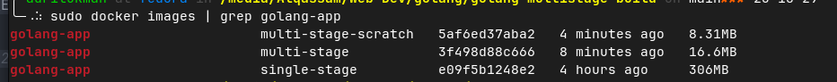

# Docker: Single-Stage vs. Multi-Stage Builds (Go)

This is a personal demo project comparing the conventional (single-stage) Dockerfile approach with the modern (multi-stage) approach for a Go application.

**Purpose**: To demonstrate how multi-stage builds produce a final image that is significantly smaller, cleaner, and more secure.


## Files in This Repository

- `main.go`: A simple Go web server with / and /health endpoints.
- `Dockerfile.single-stage`: A conventional, wasteful Dockerfile (produces a large image
- `Dockerfile.multi-stage`: A modern, efficient Dockerfile (produces a small image) using the \alpine`base image and a`non-root` user.`
- `(Optional: \Dockerfile.multi-stage-scratch`): The most extreme version. It uses `FROM scratch`, which is an empty image with no Linux OS. The final image contains only the binary from the build result.

---

## Building and Seeing the Difference

You can build all three images to see the size comparison for yourself.

### 1. Build Image Single-Stage (The Large Way)

This command creates the **large**, conventional image. It's big because it contains the Go compiler, source code, and all build dependencies.

```bash
docker build -f Dockerfile.single-stage -t golang-app:single-stage . --no-cache
```

### 2. Build Image Multi-Stage

This command creates the small, efficient image. It only contains the final application binary and the minimal alpine base, leaving all build tools behind.

```bash
docker build -t golang-app:single-stage -f Dockerfile.multi-stage . --no-cache
```

### 3. Build Image Multi-Stage-scratch

This command creates a very small image. It only contains the application binary and does not include a base OS, because it uses the empty `scratch image`.

```bash
docker build -f Dockerfile.multi-stage-scratch -t golang-app:multi-stage-scratch . --no-cache
```

### See The Difference

```bash
docker images | grep "golang-app"
```

<div align="center">
  
  <br/>
  <em>Result images</em>
</div>
<br>

### Conclusion

As shown by the docker images output above, the difference in final image size is significant:

📦 Single-stage: 306MB (Large)
Reason: Contains the full Go compiler, dependencies, and source code.

✨ Multi-stage: 16.6MB (Small)
Reason: Only contains the final binary and the minimal Alpine base image.

🔬 Multi-stage-scratch: 8.31MB (Extremely Small)
Reason: Contains only the application binary and no base OS at all.
